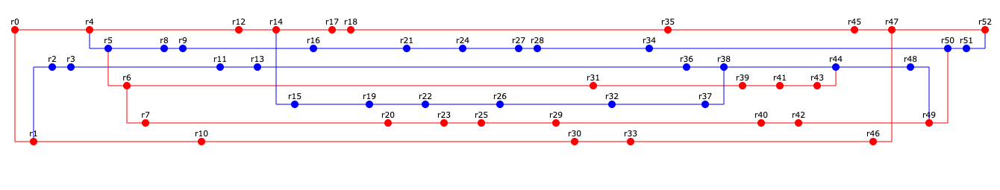

## Лабораторная работа #2

Сконфигурировать в своём домашнем каталоге репозитории svn и git и загрузить в них начальную ревизию файлов с исходными кодами (в соответствии с выданным вариантом).

Воспроизвести последовательность команд для систем контроля версий __svn__ и __git__, осуществляющих операции над исходным кодом, приведённые на блок-схеме.

При составлении последовательности команд необходимо учитывать следующие условия:
- Цвет элементов схемы указывает на пользователя, совершившего действие (красный - первый, синий - второй).
- Цифры над узлами - номер ревизии. Ревизии создаются последовательно.
- Необходимо разрешать конфликты между версиями, если они возникают.

### То, что уже реализовано

Git:
- init - инициализация репозитория
- new-branch - создание новой ветки
- set-user - установка текущего пользователя
- commit - создание коммита
- merge - слияние веток

### Надо реализовать
- Svn